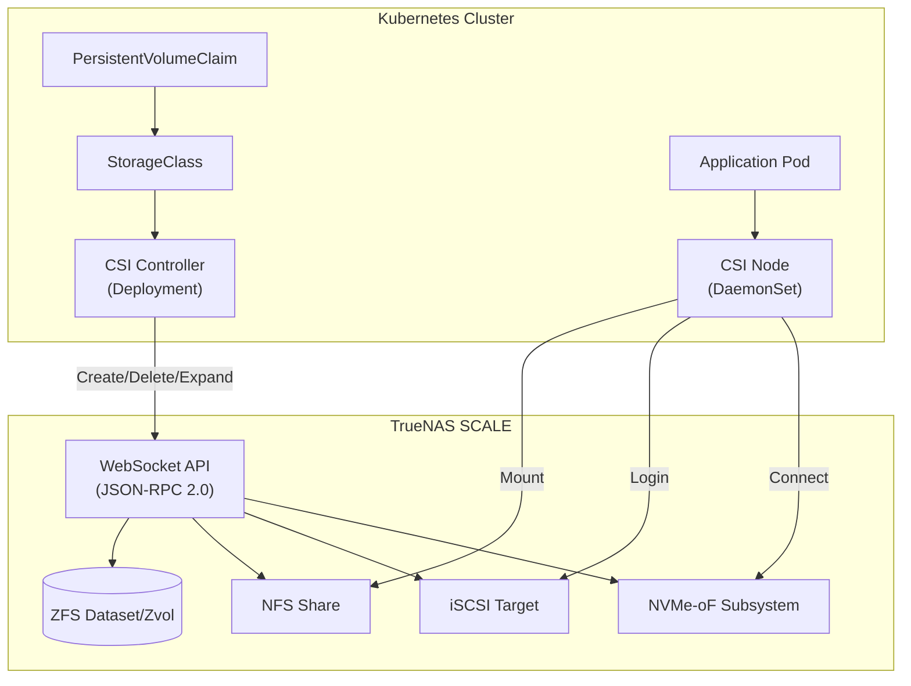
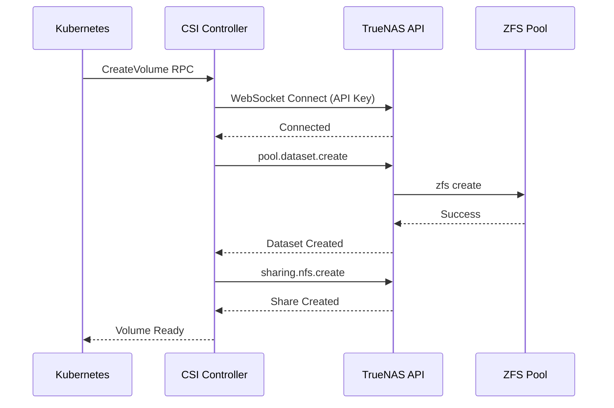
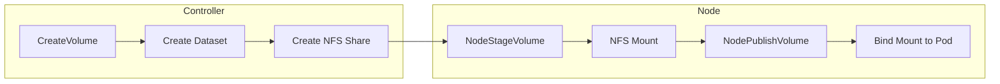
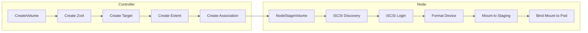
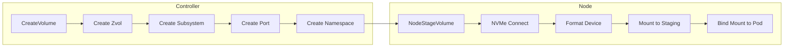
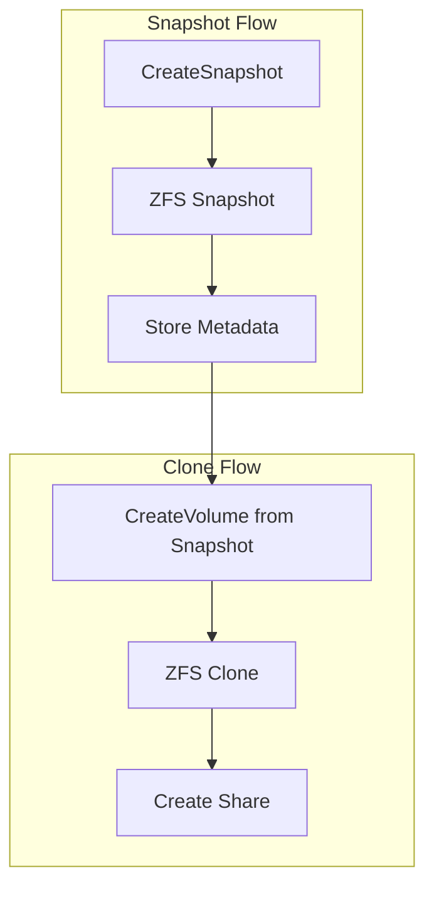

# TrueNAS Scale CSI Architecture

This document explains the internal architecture and workflows of the TrueNAS Scale CSI driver.

## High-Level Architecture



## Component Overview

The driver follows the standard Kubernetes CSI (Container Storage Interface) architecture, consisting of two main components:

### 1. CSI Controller (Deployment)
- **Type**: Deployment (usually 1 replica)
- **Responsibility**: Communicates with the TrueNAS API to manage storage resources.
- **Operations**:
  - `CreateVolume`: Creates ZFS datasets (NFS) or Zvols (iSCSI/NVMe-oF).
  - `DeleteVolume`: Deletes datasets/zvols.
  - `ControllerExpandVolume`: Resizes datasets/zvols (updates quotas/volsize).
  - `CreateSnapshot`: Creates ZFS snapshots.
  - `DeleteSnapshot`: Deletes ZFS snapshots.
  - `CreateVolume` (from Snapshot): Clones ZFS snapshots to new datasets/zvols.

### 2. CSI Node (DaemonSet)
- **Type**: DaemonSet (runs on every node)
- **Responsibility**: Mounts storage volumes to the Kubernetes node and Pods.
- **Operations**:
  - `NodeStageVolume`: Connects to storage (NFS mount, iSCSI login, NVMe connect) and formats device (if needed).
  - `NodePublishVolume`: Bind-mounts the staged volume into the Pod's container.
  - `NodeGetVolumeStats`: Reports storage usage (df/inodes) to Kubernetes.
  - `NodeExpandVolume`: Resizes the filesystem on the node (e.g., `resize2fs`).

## Communication Flow

All control plane operations use the **TrueNAS WebSocket JSON-RPC 2.0 API**.



1. **Authentication**: The driver connects to `wss://<host>/api/current` using an API Key.
2. **Persistence**: The WebSocket connection is persistent and auto-reconnects.
3. **No SSH**: Unlike legacy drivers, this driver **does not** use SSH. All operations, including filesystem formatting (handled by the node), are done via API or local node tools.

## Storage Workflows

### NFS (Filesystem)



1. **Provisioning**: Controller creates a ZFS dataset with `type=FILESYSTEM`.
2. **Exporting**: Controller creates an NFS share for the dataset path.
3. **Mounting**: Node uses `mount -t nfs` to mount the dataset path.
4. **Access**: Supports `ReadWriteMany` (RWX) and `ReadWriteOnce` (RWO).

### iSCSI (Block)



1. **Provisioning**: Controller creates a ZFS volume (`zvol`) with `type=VOLUME`.
2. **Exporting**: Controller creates an iSCSI Target, Extent, and TargetExtent mapping.
3. **Attachment**: Node uses `iscsiadm` to discover and login to the target.
4. **Formatting**: Node formats the device (ext4/xfs) if it's a new volume.
5. **Mounting**: Node mounts the formatted device.
6. **Access**: Primarily `ReadWriteOnce` (RWO).

### NVMe-oF (Block)



1. **Provisioning**: Controller creates a ZFS volume (`zvol`).
2. **Exporting**: Controller creates an NVMe Subsystem, Port association, and Namespace.
3. **Attachment**: Node uses `nvme-cli` to connect to the subsystem (TCP/RDMA).
4. **Formatting**: Node formats the device.
5. **Mounting**: Node mounts the formatted device.
6. **Access**: `ReadWriteOnce` (RWO).

## Snapshots & Clones



The driver leverages native ZFS capabilities:
- **Snapshots**: Instantaneous ZFS snapshots (`zfs snapshot`).
- **Clones**: ZFS clones (`zfs clone`) for creating new volumes from snapshots. This allows for instant provisioning of test environments from production data.

## Volume ID Format

Volume IDs encode the storage protocol and ZFS path:

```
{driver}:{dataset_path}
```

Examples:
- `scale-nfs:tank/k8s/volumes/pvc-abc123`
- `scale-iscsi:tank/k8s/volumes/pvc-abc123`
- `scale-nvmeof:tank/k8s/volumes/pvc-abc123`

## ZFS User Properties

The driver tracks CSI metadata using ZFS user properties prefixed with `truenas-csi:`:

| Property | Description |
|----------|-------------|
| `truenas-csi:managed_resource` | Marks CSI-managed datasets |
| `truenas-csi:csi_volume_name` | Original PVC name |
| `truenas-csi:truenas_nfs_share_id` | Associated NFS share ID |
| `truenas-csi:truenas_iscsi_target_id` | Associated iSCSI target ID |
| `truenas-csi:truenas_iscsi_extent_id` | Associated iSCSI extent ID |
| `truenas-csi:truenas_nvmeof_subsystem_id` | Associated NVMe-oF subsystem ID |

## VolSync Integration

The driver fully supports the `Snapshot` copy method in VolSync:
1. **Backup**: VolSync requests a CSI Snapshot -> Driver creates ZFS Snapshot.
2. **Restore**: VolSync requests a PVC from Snapshot -> Driver creates ZFS Clone from Snapshot.

See [Snapshots and Clones Guide](guides/snapshots.md) for detailed usage instructions.
