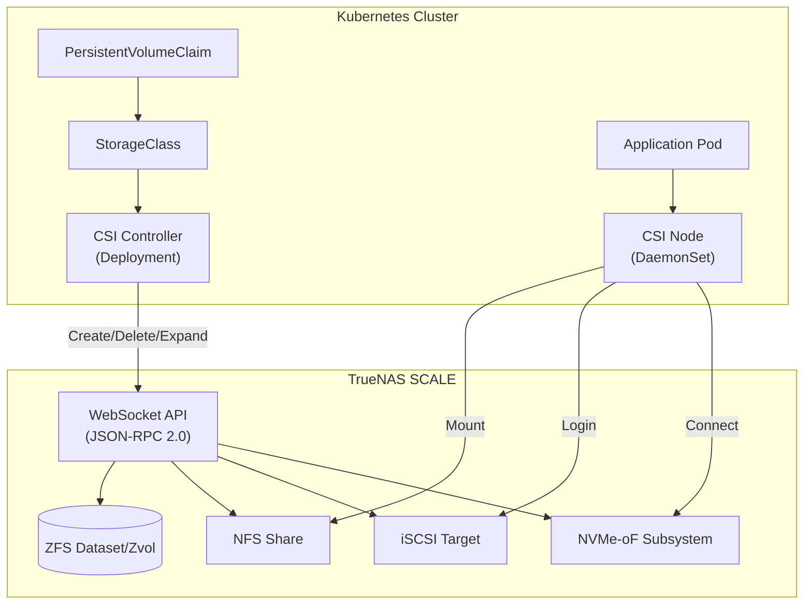
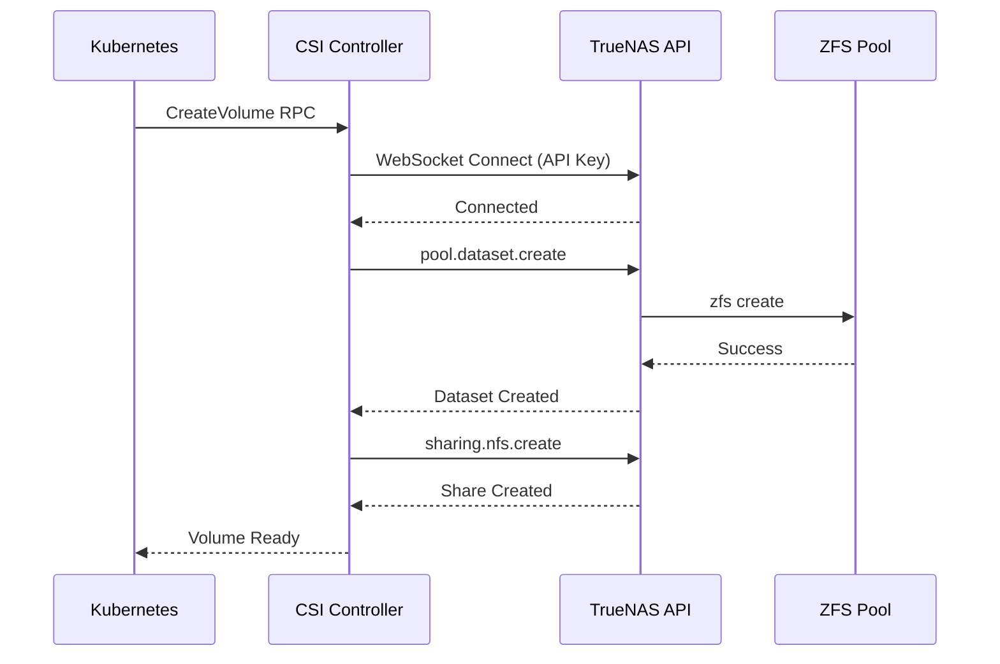
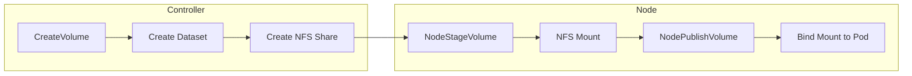
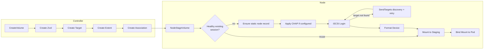
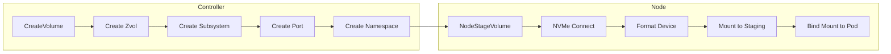
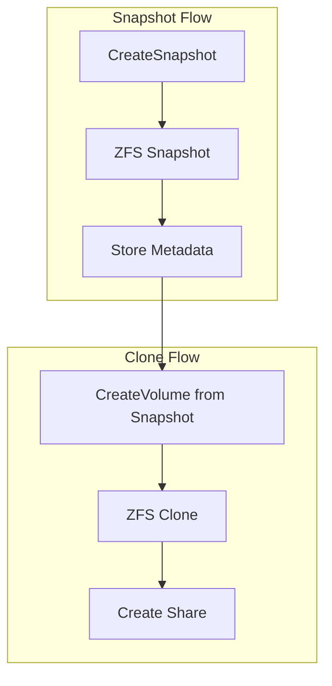

# TrueNAS Scale CSI Architecture

This document explains the internal architecture and workflows of the TrueNAS Scale CSI driver.

## High-Level Architecture

```mermaid
graph TB
    subgraph "Kubernetes Cluster"
        PVC[PersistentVolumeClaim]
        SC[StorageClass]
        Controller["CSI Controller<br/>(Deployment)"]
        Node["CSI Node<br/>(DaemonSet)"]
        Pod[Application Pod]
    end

    subgraph "TrueNAS SCALE"
        API["WebSocket API<br/>(JSON-RPC 2.0)"]
        Dataset[(ZFS Dataset/Zvol)]
        NFS[NFS Share]
        ISCSI[iSCSI Target]
        NVME[NVMe-oF Subsystem]
    end

    PVC --> SC
    SC --> Controller
    Controller -->|Create/Delete/Expand| API
    API --> Dataset
    API --> NFS
    API --> ISCSI
    API --> NVME
    Node -->|Mount| NFS
    Node -->|Login| ISCSI
    Node -->|Connect| NVME
    Pod --> Node
```

## Component Overview

The driver follows the standard Kubernetes CSI (Container Storage Interface) architecture, consisting of two main components:

### 1. CSI Controller (Deployment)
- **Type**: Deployment (usually 1 replica)
- **Responsibility**: Communicates with the TrueNAS API to manage storage resources.
- **Operations**:
  - `CreateVolume`: Creates ZFS datasets (NFS) or Zvols (iSCSI/NVMe-oF).
  - `DeleteVolume`: Deletes datasets/zvols.
  - `ControllerExpandVolume`: Resizes datasets/zvols (updates quotas/volsize).
  - `CreateSnapshot`: Creates ZFS snapshots.
  - `DeleteSnapshot`: Deletes ZFS snapshots.
  - `CreateVolume` (from Snapshot): Clones ZFS snapshots to new datasets/zvols.

### 2. CSI Node (DaemonSet)
- **Type**: DaemonSet (runs on every node)
- **Responsibility**: Mounts storage volumes to the Kubernetes node and Pods.
- **Operations**:
  - `NodeStageVolume`: Connects to storage (NFS mount, iSCSI login, NVMe connect) and formats device (if needed).
  - `NodePublishVolume`: Bind-mounts the staged volume into the Pod's container.
  - `NodeGetVolumeStats`: Reports storage usage (df/inodes) to Kubernetes.
  - `NodeExpandVolume`: Resizes the filesystem on the node (e.g., `resize2fs`).

## Communication Flow

All control plane operations use the **TrueNAS WebSocket JSON-RPC 2.0 API**.

```mermaid
sequenceDiagram
    participant K8s as Kubernetes
    participant Ctrl as CSI Controller
    participant API as TrueNAS API
    participant ZFS as ZFS Pool

    K8s->>Ctrl: CreateVolume RPC
    Ctrl->>API: WebSocket Connect (API Key)
    API-->>Ctrl: Connected
    Ctrl->>API: pool.dataset.create
    API->>ZFS: zfs create
    ZFS-->>API: Success
    API-->>Ctrl: Dataset Created
    Ctrl->>API: sharing.nfs.create
    API-->>Ctrl: Share Created
    Ctrl-->>K8s: Volume Ready
```

1. **Authentication**: The driver connects to `wss://<host>/api/current` using an API Key.
2. **Persistence**: The WebSocket connections are persistent and auto-reconnect.
3. **No SSH**: Unlike legacy drivers, this driver **does not** use SSH. All operations, including filesystem formatting (handled by the node), are done via API or local node tools.

### WebSocket connection pool and resilience pipeline

The controller does not use a single socket. It maintains a **pool of WebSocket
connections** — sized by `truenas.maxConnections` (default 5, valid range 1..16;
the pool is built once at client construction) — and multiplexes requests across
them round-robin, so concurrent RPCs are not serialized behind one connection. On
top of that, a **10-slot semaphore** — configurable via `truenas.maxConcurrentRequests`
(default 10) — caps how many API calls are in flight at once, protecting TrueNAS
from overload. (The node-only DaemonSet builds no management client at all; this
pool exists only in controller mode.)

Every backend call funnels through one resilience pipeline (`callRaw`):

- **Circuit breaker** (opt-in, `resilience.circuitBreaker.enabled`, default off):
  after N consecutive failures it opens for a timeout, then admits half-open
  probes.
- **Connection-class retry** with exponential backoff: only connection/transport
  failures are retried. An ambiguous non-idempotent mutation is **not** retried.
- **Per-call deadline**: `requestTimeout` bounds only calls that carry no
  deadline of their own (background work); CSI RPCs are bounded by the sidecar
  `--timeout` they inherit.

**Ambiguity taxonomy.** Two sentinel errors classify transport outcomes so the
retry logic never double-applies a non-idempotent write:

- `ErrTransportFailure` — the request failed before it could have been applied
  (e.g. "connection lost before request was sent" / "during authentication"). It
  is safe to retry and is recorded as a breaker failure.
- `ErrAmbiguousResult` — the request was written but no response was observed, so
  whether it took effect is unknown. It is not blindly retried; callers reconcile
  by re-reading state.

Because the WebSocket read limit on TrueNAS rejects inbound frames over ~64 kB
(close 1009), the driver chunks large property writes (for example the
bookkeeping migration and batched ledger removals) to stay well under that
limit.

## Storage Workflows

### NFS (Filesystem)

```mermaid
flowchart LR
    subgraph Controller
        A[CreateVolume] --> B[Create Dataset]
        B --> C[Create NFS Share]
    end
    subgraph Node
        D[NodeStageVolume] --> E[NFS Mount]
        E --> F[NodePublishVolume]
        F --> G[Bind Mount to Pod]
    end
    C --> D
```

1. **Provisioning**: Controller creates a ZFS dataset with `type=FILESYSTEM`.
2. **Exporting**: Controller creates an NFS share for the dataset path.
3. **Mounting**: Node uses `mount -t nfs` to mount the dataset path.
4. **Access**: Supports `ReadWriteMany` (RWX) and `ReadWriteOnce` (RWO).

### iSCSI (Block)

```mermaid
flowchart LR
    subgraph Controller
        A[CreateVolume] --> B[Create Zvol]
        B --> C[Create Target]
        C --> D[Create Extent]
        D --> E[Create Association]
    end
    subgraph Node
        F[NodeStageVolume] --> G{Healthy existing<br/>session?}
        G -->|reuse| J[Mount to Staging]
        G -->|no| H[Ensure static node record]
        H --> H2[Apply CHAP if configured]
        H2 --> H3[iSCSI Login]
        H3 -->|target not found| D2[SendTargets discovery + retry]
        D2 --> H3
        H3 --> I[Format Device]
        I --> J
        J --> K[Bind Mount to Pod]
    end
    E --> F
```

1. **Provisioning**: Controller creates a ZFS volume (`zvol`) with `type=VOLUME`.
2. **Exporting**: Controller creates an iSCSI Target, Extent, and TargetExtent mapping.
3. **Attachment**: The node path first **reuses a validated healthy existing
   session**. For a fresh connection it ensures a static node record, applies CHAP
   if the class configured it, then logs in. `SendTargets` **discovery is only a
   fallback** when the fast login reports target-not-found / no portal record — it
   does not precede every login.
4. **Formatting**: Node formats the device (ext4/xfs) if it's a new volume.
5. **Mounting**: Node mounts the formatted device.
6. **Access**: Primarily `ReadWriteOnce` (RWO).

### NVMe-oF (Block)

```mermaid
flowchart LR
    subgraph Controller
        A[CreateVolume] --> B[Create Zvol]
        B --> C[Create Subsystem]
        C --> D[Create Port]
        D --> E[Create Namespace]
    end
    subgraph Node
        F[NodeStageVolume] --> G[NVMe Connect]
        G --> H[Format Device]
        H --> I[Mount to Staging]
        I --> J[Bind Mount to Pod]
    end
    E --> F
```

1. **Provisioning**: Controller creates a ZFS volume (`zvol`).
2. **Exporting**: Controller creates an NVMe Subsystem, Port association, and Namespace.
3. **Attachment**: Node uses `nvme-cli` to connect to the subsystem (TCP/RDMA).
4. **Formatting**: Node formats the device.
5. **Mounting**: Node mounts the formatted device.
6. **Access**: `ReadWriteOnce` (RWO).

## Snapshots & Clones

```mermaid
flowchart TB
    subgraph "Snapshot Flow"
        A[CreateSnapshot] --> B[ZFS Snapshot]
        B --> C[Store Metadata]
    end
    subgraph "Clone Flow"
        D[CreateVolume from Snapshot] --> E[ZFS Clone]
        E --> F[Create Share]
    end
    C --> D
```

The driver leverages native ZFS capabilities:
- **Snapshots**: Instantaneous ZFS snapshots (`zfs snapshot`).
- **Restore from a snapshot**: how a *snapshot-sourced* create is materialized
  depends on the resolved `snapshotRestoreMode` (StorageClass parameter, falling
  back to the driver's `zfs.detachedVolumesFromSnapshots` default):
  - `clone` (default) creates a `zfs clone` — instant and space-efficient, but the
    restored volume **pins its source snapshot** for its whole life (not
    lifecycle-independent, even though its writes are independent).
  - `detached` performs a local send/receive copy — costs time and space up
    front but has **no origin dependency** afterward.
- **Volume-to-volume clone** (PVC dataSource) is always clone-backed regardless of
  `snapshotRestoreMode`: the driver takes an internal temporary snapshot and
  `zfs clone`s it.
- **Lazy clone independence (GF2/E3, opt-in `zfs.promoteRestoredClones`)**: a
  background reconcile step can `pool.dataset.promote` a clone-restored volume to
  drop its origin-snapshot pin once it is the **sole dependent** of that origin,
  making the restored volume lifecycle-independent and letting the tombstone
  reaper reclaim the source snapshot (and the source volume become destroyable).
  Promote is a single atomic ZFS operation, but it is far from a simple unpin: it
  MOVES the origin snapshot **and every snapshot older-or-equal to it** onto the
  promoted clone, re-parents all sibling clones, and re-parents the SOURCE dataset
  itself onto the promoted one. The step therefore refuses unless every gate
  holds, all re-proven under the clone's and the source volume's operation locks
  immediately before the call:
  - the candidate is re-read with a source-bearing `pool.dataset.query` (the
    reconcile listing's `zfs.resource.query` projection carries no property
    source, so the ownership stamp cannot be proven from it);
  - the authoritative `pool.dataset.query` origin projection shows this clone is
    the **sole** dependent of the origin snapshot — including unmanaged clones
    under the CSI parent that the driver's managed-dataset listing never sees;
  - no OTHER live CSI VolumeSnapshot is in the migrating set. Such a snapshot's
    backend ID would silently change, so `SnapshotGet` of its recorded ID would
    404 and `DeleteSnapshot` would report success while it persisted forever;
  - every migrating tombstone's ledger entry is RE-KEYED to its post-promote ID
    **before** the promote, so the reaper's provenance follows the snapshot.
    (Writing the new key first is the crash-safe order: a ledger entry whose
    snapshot does not exist is what the age-gated ledger sweep retires, whereas a
    migrated tombstone with no entry would be unreapable forever.)

  Residual, documented limitation: a clone living OUTSIDE the CSI parent subtree
  is invisible to every TrueNAS 26.0 API (snapshots no longer expose `clones`),
  so it cannot be counted by the sole-dependent gate.

## Volume ID Format

The volume ID is the sanitized CSI request name and is also the child dataset
or zvol basename beneath `zfs.datasetParentName`. It does not encode the
protocol or full ZFS path. For example, a request named `pvc-abc123` produces
volume ID `pvc-abc123` and backend object
`tank/k8s/volumes/pvc-abc123`. Protocol identity is stored in volume context
and ZFS user properties.

## ZFS User Properties

The driver stores **all durable per-volume CSI metadata** as ZFS user properties
prefixed with `scale-csi:` — there is no external database for it, which is what
makes the driver restart-recoverable and ZFS-replication-friendly (see the
[disaster-recovery guide](guides/disaster-recovery.md)). Two exceptions are
**not** ZFS properties and must be managed/recovered separately: CHAP **secret
material** (a request-scoped CSI Secret) and the TrueNAS `iscsi.auth` **peer
object** (configuration-database state). The per-volume CHAP *policy* (tag and
mode) is property-backed — see the CHAP properties below.

**Ownership and identity**

| Property | Description |
|----------|-------------|
| `scale-csi:managed_resource` | Marks CSI-managed datasets (read with property source; a *local* value is required — an inherited one does not prove ownership) |
| `scale-csi:driver_instance_id` | Stamps which driver instance owns the dataset; never overwritten once set (local, inherited, or foreign) |
| `scale-csi:csi_volume_name` | Original PVC/request name |
| `scale-csi:provision_success` | Marks provisioning as completed |
| `scale-csi:requested_size_bytes` | Requested CSI capacity, stored only for quota-disabled NFS/filesystem volumes where the backend quota cannot otherwise preserve it |

**Content source (clones/restores)**

| Property | Description |
|----------|-------------|
| `scale-csi:csi_volume_content_source_type` / `_id` | Records the snapshot or volume a restore/clone was created from |
| `scale-csi:csi_volume_origin_snapshot` | Principally the deterministic temporary origin snapshot used for a volume-to-volume clone, so it can be cleaned up when the clone is deleted; a `detached` copy explicitly sets it to `-` |

**Crash-consistency bookkeeping**

| Property | Description |
|----------|-------------|
| `scale-csi:inflight_*` | In-flight markers written before a **content-source clone/copy** mutation and cleared on success; the only handle a crash-recovery sweep can act on (a fresh dataset create has no marker) |
| `scale-csi:recovery_nonce` | Write-then-verify identity token for lost-race detection |
| `scale-csi:tombstone_*` | Deferred-delete tombstone ledger. The property key is a hash of the tombstone snapshot ID; v2 stores the snapshot's `CreateTXG` in the entry as an extra immutable identity predicate (degrading to the v1 full-ID + creation-seconds check when TXG is unavailable). v1 entries remain readable |
| `scale-csi:publication_*` | Durable per-volume publication records (see fencing, below) |
| `scale-csi:internal_resource` | Marks internal temporary snapshots used by volume-to-volume cloning so they are excluded from `ListSnapshots` (it does **not** mark the `.csi-bookkeeping` dataset — that is identified by its reserved leaf name) |
| `scale-csi:snapshot_naming_schema` / `scale-csi:snapshot_task_id` | The driver-minted strftime naming schema bound to a scheduled volume's periodic-snapshot task, and that task's id (GF2/E2) |
| `scale-csi:snapshot_task_corroboration` | Records that this driver instance observed its OWN live, dataset-scoped task carrying that schema, written just before the task is deleted so a RETRIED `DeleteVolume` can still recognize the volume's scheduled snapshots instead of wedging behind the foreign guard |

**Backend share-object backreferences**

| Property | Description |
|----------|-------------|
| `scale-csi:truenas_nfs_share_id` | Associated NFS share ID |
| `scale-csi:truenas_iscsi_target_id` / `_extent_id` / `_targetextent_id` / `_initiator_id` | iSCSI object IDs |
| `scale-csi:truenas_nvmeof_subsystem_id` / `_namespace_id` / `_portsubsys_id` | NVMe-oF object IDs |

**iSCSI CHAP policy (immutable per volume)**

| Property | Description |
|----------|-------------|
| `scale-csi:truenas_iscsi_auth_tag` | The `iscsi.auth` tag the target group's auth ref points at; stamped immutably at `CreateVolume` |
| `scale-csi:truenas_iscsi_auth_mode` | The immutable per-volume auth mode (`CHAP` or `CHAP_MUTUAL`); every fence pass reconstructs `authmethod`+auth purely from these two properties |

The CHAP **credential** itself is never a ZFS property; it is a request-scoped
CSI Secret, and the backing TrueNAS `iscsi.auth` peer is configuration-database
state that does not replicate with the pool.

Snapshots carry their own identity properties (`scale-csi:csi_snapshot_name`,
`scale-csi:csi_snapshot_source_volume_id`, `scale-csi:csi_share_volume_context`).

## VolSync Integration

The driver fully supports the `Snapshot` copy method in VolSync:
1. **Backup**: VolSync requests a CSI Snapshot -> Driver creates a ZFS Snapshot.
2. **Restore**: VolSync requests a PVC from a Snapshot -> Driver materializes it
   per the target StorageClass's `snapshotRestoreMode` — a ZFS clone (default,
   pins the source snapshot) or a detached send/receive copy (no origin
   dependency).

See [Snapshots and Clones Guide](guides/snapshots.md) for detailed usage instructions.

## Controller topology, node mode, and leader election

- **Controller** runs as a Deployment, default **1 replica**. This singleton
  topology is the primary cross-process serialization guarantee — the driver's
  operation locks are per-process and provide no exclusion between two controller
  processes.
- **Leader election** is enabled on every capable controller sidecar
  (provisioner, attacher, resizer, snapshotter) **unconditionally**, even at a
  single replica, so a `fencing.mode=off` RollingUpdate that briefly runs two
  controller pods never has both acting as the active provisioner/attacher.
- **Node** runs as a DaemonSet and is **credential-free**: it receives no
  `TRUENAS_API_KEY` and **constructs no TrueNAS management client at all**. Every
  supported Node RPC (stage/publish/unpublish/unstage and local filesystem
  expansion) uses host tools (`mount`, `iscsiadm`, `nvme`, `resize2fs`) and local
  host state. There is **no deferred/lazy management-API path** on node pods that
  could later fail for lack of credentials; node pods initialize and report ready
  independently of TrueNAS reachability.
- `additive`/`strict` fencing require **exactly one** controller replica because
  their background reconcilers are singleton writers; chart schema and template
  guards enforce that.

## Publication records and backend fencing

CSI publish state is always tracked in durable per-volume **publication records**
(`scale-csi:publication_*`). Single-node exclusivity, same-node republish
idempotency, synchronous stale-record takeover, and empty-node-id unpublish are
enforced in **every** mode. `fencing.mode` governs only whether that state is
*also* pushed into the backend transport allowlists:

| Mode | Behavior |
|------|----------|
| `off` (default) | Records-only. No NFS/iSCSI/NVMe allowlist mutation. |
| `additive` | Adds the publishing node's identity to the backend allowlist without removing statically configured entries. The explicit migration mode. |
| `strict` | Per-volume publication records become the sole allowlist. |

Node identity is a stable base64url encoding (name + block-transport identity)
carried on the CSINode registration with an `sc1.` prefix. The node-first
migration (upgrade the DaemonSet, wait for every CSINode to re-register, watch
`scale_csi_fencing_deferred_total`) is described in
[Production](production.md#upgrades).

## Crash-consistency model

The driver has no external database, so it makes its riskiest mutations
crash-recoverable through ordered ZFS user-property writes. Recovery is
**narrow, not universal**: it covers the content-source clone/copy window, and a
fresh dataset create that crashes in an unstamped creation/share-property window
fails closed and may require manual cleanup.

- **In-flight markers** (`scale-csi:inflight_*`) are written *before* a
  **content-source clone/copy** mutation and cleared on success. After a crash, a
  marked-but-unstamped clone/copy dataset is the only remnant a recovery sweep can
  prove is ours and reclaim. A plain (non-content-source) create has no marker.
- **Ownership stamps** (`managed_resource` + `driver_instance_id`, read with
  property *source* so inherited values never count) prove the object is this
  instance's. A `driver_instance_id` is never overwritten once present.
- **Content-source vs. ownership boundary**: a restored/cloned dataset records
  where it came from (`csi_volume_content_source_*`) separately from who owns it.
  A clone can inherit its source's protocol-foreign backreference properties, so
  the driver scrubs source-proven foreign IDs after stamping.
- **Recovery nonce** (`recovery_nonce`) is a write-then-verify token: a detected
  lost race returns retryable `Aborted` rather than double-owning a dataset. It
  is not an atomic compare-and-swap — the strongest concurrency contract remains
  the singleton controller (see [Production → Concurrency contract](production.md#concurrency-contract)).
- **Tombstone ledger** records deferred-destroy snapshots. The ledger key is a
  hash of the tombstone snapshot ID; v2 additionally stores the snapshot's
  `CreateTXG` as an immutable identity predicate (degrading to the v1 check when
  TXG is zero/unavailable). v1 entries stay compatible. The reaper acts only on
  provenance it can prove.

## Reconcile loop and source layout

A controller-side reconcile pass (`ReconcileOrphans`, default hourly; also
runnable once via `--mode=reconcile`) detects and — only under
`reconcile.delete.enabled` — deletes CSI-managed **orphan objects** (volumes and
snapshots) with no live Kubernetes reference; a shared
`reconcile.delete.maxPerRun` caps those destructive deletions per pass.
Always-on repair writes (stamp adoption, property-namespace migration) are
capped separately by `reconcile.repair.maxPerRun`.

**The pass as a whole is not read-only.** The safety guarantee is narrower:
**orphan object deletion is disabled by default**. Independent of
`reconcile.enabled` and guarded delete, a pass performs always-on repair
mutations — it can write/adopt legacy ownership stamps
(`reconcile_adoption.go`), repair stale bookkeeping/marker and publication state,
and the replication-job sweep can call `core.job_abort` on orphaned
`replication.run_onetime` jobs (this sweep runs even when both `reconcile.enabled`
and guarded delete are off). Only the orphan-volume/snapshot, tombstone, and
remnant destroys are gated behind `reconcile.delete.enabled`.

The v1.3.0 refactor split the former monolithic `reconcile.go` along its test
seams into per-concern files:

| File | Concern |
|------|---------|
| `reconcile.go` | Pass orchestration + orphan volume/snapshot/tombstone classification |
| `reconcile_kubestate.go` | Live PV / VolumeAttachment / VolumeSnapshotContent hard-rechecks (not informer caches) |
| `reconcile_publications.go` | Stale publication-record repair |
| `reconcile_shares.go` | Orphaned NFS/iSCSI/NVMe-oF share detection and teardown |
| `reconcile_tombstones.go` | Tombstone reaper, scan-fallback, ledger sweep |
| `reconcile_remnants.go` | Stale in-flight marker sweep, remnant-orphan GC, orphaned replication-job sweep |
| `reconcile_spent_restore.go` | VolSync spent-restore snapshot classification |
| `reconcile_adoption.go` | Legacy ownership-stamp adoption |
| `provenance.go` | Ownership stamping, in-flight markers, tombstone ledger, bookkeeping relocation/chunking |
| `fencing.go` / `fence_resolution.go` | Publication records and backend allowlist enforcement |
| `share_backend.go` | `ShareBackend` interface + per-protocol selector |

## API-call cost (golden round-trip counts)

Hot paths are pinned by golden tests (`api_call_count_test.go`) so a regression
that adds a wasted round trip fails loudly. Representative controller costs:

| Operation | TrueNAS round trips |
|-----------|--------------------:|
| CreateVolume (fresh NFS) | 6 |
| CreateVolume (fresh iSCSI) | 14 |
| CreateVolume (NFS clone from **snapshot** source) | 10 |
| CreateVolume (NFS clone from **volume** source) | 13 |
| CreateVolume / CreateSnapshot (idempotent retry) | 2 |
| DeleteVolume (NFS / iSCSI) | 6 / 10 |
| ControllerPublish/Unpublish (fencing `off`, NFS) | 3 |
| ControllerPublish/Unpublish (`additive`, NFS) | 5 |
| ControllerPublish/Unpublish (`strict`, NVMe-oF, steady-state) | 9 |

Clone cost is per-protocol/source-type, not a single protocol-independent number
(the older "12" predates the single-get fold). These are the counts pinned by the
golden fixtures; a live end-to-end re-measure is pending post-deploy.
